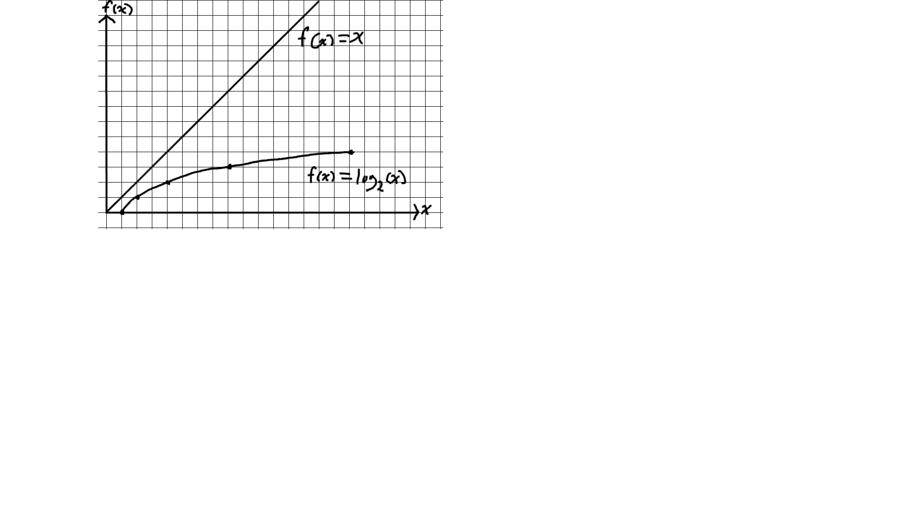

# Standford Algorithms 1 Course

## 1.1: Why Study Algorithms

A video briefly explaining the purpose of the course

## 1.2: Integer Multiplication

**Input**: Two n-digit numbers x and y
**Desired Output**: The product x * y

### *Definition*
- **Primitive Operation**: Add or multiply 2 single-digit numbers

### The Grade-School Algorithm


**Upshot**:  # operations overal is <= (some constant) * n^2

### *The Algorithm Designer's Mantra*
"Perhaps the most important principle for the good algorithm
designer is to refuse to be content."
	- Aho, Hopcroft, and Ullman, *The Design and
	Analysis of Computer Algorithms*, 1974

## 1.3: Karatsuba Multiplication

**Example**


### A Recursive Algorithm

Write x = 10^(n/2) * a + b and y = 10^(n/2) * c + d  
where a, b, c, d are n/2 - digit numbers  
[example: a = 56, b = 78, c = 12, d = 34]

**Then**: x * y = (10^(n/2) * a + b) * (10^(n/2) * c + d)
= [10^n * ac + 10^(n/2)(ad + bc) + bd] -> (*)

**Idea**: Recursively compute ac, ad, bc, and bd. Then  
compute (*) using the grade school method  
Recursion would decrement with each subsequent function call and  
the base case would be if either digit was of size 1, you would return  
the product of the input two numbers

**In Python**

```python
def gradeschool(i, j):

    if len(str(i)) == 1 or len(str(j)) == 1:
        return i * j

    n = len(str(i))
    a = (i - i%(10**(n/2)))/(10**(n/2))
    b = (i%(10**(n/2)))

    c = (j - j%(10**(n/2)))/(10**(n/2))
    d = (j%(10**(n/2)))

    return (10**n) * gradeschool(int(a),int(c)) + (10**(n/2)) * 
    	(gradeschool(int(a),int(d)) + gradeschool(int(b),int(c))) + 
		gradeschool(int(b),int(d))

print(gradeschool(1234,5678))
```
### Recursive Algorithm Using Karatsuba Multiplication

**Recall**: x * y = 10^n * ac + 10^(n/2)(ad + bc) + bd (*)

**Step 1**: Recursively compute ac  
**Step 2**: Recursively compute bd  
**Step 3**: Recursively compute (a + b)(c + d) = ac + ad + bc + bd  
**Gauss's Trick**: ***3*** - ***1*** - ***2*** = ad + bc  

**Upshot**: Only need 3 recursive multiplications and some additions

**In Python**
```python

def karatsuba(i, j):

    if len(str(i)) == 1 or len(str(j)) == 1:
        return int(i) * int(j)

    n = len(str(i))

    a = (i - i%(10**(n/2)))/(10**(n/2))
    b = (i%(10**(n/2)))

    c = (j - j%(10**(n/2)))/(10**(n/2))
    d = (j%(10**(n/2)))

    ac = karatsuba(int(a), int(c))
    bd = karatsuba(int(b), int(d))
    sum = karatsuba(int(a + b), int(c + d)) - ac - bd 

    return (10**n) * ac + (10**(n/2)) * (sum) + bd


print(karatsuba(1234,5678))
```
## 1.3: About the Course

***Course Topics***
- Vocabulary for design and analysis 
	- e.g., "Big-O" notation
	- "sweet spot" for high level reasoning about algorithms
- Divide and conquer algorithm design paradigm
	- Will apply to: Integer mulitplication, sorting, matrix  
	multiplication, closest pair
	- General analysis methods ("Master Method/Theorem")
- Randomization in algorithm design
	- Will apply to: Quicksort, primality testing, graph  
	partioning, hashing
- Primitives for reasoning about graphs
	- Connectvity information, shortest paths, structure of  
	information and social networks
- Use and implementation of data structures
	- Heaps, balanced binary search trees, hashing and some  
	variants (e.g., bloom filters)

***Topics in Sequel Course***
- Greedy algorithm design and paradigm
	- Minimum expanding trees, scheduling, information  
	theoretic coding
- Dynamic programming algorithm design paradigm
- NP-complete problems and what to do about them
- Fast heuristics with provable guarantees
- Fast exact algorithms for special cases
- Exact algorithms that beat brute-force search

***Skills You'll Learn***
- Become a better programmer
- Sharpen your mathematical and analytical skills
- Start "thinking algorithmically"
- Literacy with computer sciences's "greatest hits"
- Ace your technical interviews

***Who Are You?***
- It doesn't really matter. (It's a free course, after all.)
- Ideally, you know some programming
- Doesn't matter which languages(s) you know.
	- But you should be capable of translating high-level  
	algorithm descriptions into working programs in *some*  
	programming language
- Some (perhaps rusty) mathematical experiance.
	- Basic discrete math, proofs by induction, etc.
- *Excellent free reference*: "Mathematics for Computer Sciences",  
by Eric Lehman and Tome Leighton

***Supporting Materials***
- All (annotated) slides available from course site
- No required textbook. A few of the many good ones:
	- Kleinberg/Tardos, *Algorith Design*, 2005
	- Dasgupta/Papadimitriou/Vazirani, *Algorithms*, 2006
	- Corement/Leiserson/Rivest/Stein, *Introduction to  
	Algorithms*, 2009 (3rd edition)
	- Mehlhorn/Sanders, *Data Structures and Algorithms: The  
	Basic Toolbox*, 2008
- No specific development environment required
	- But you should be able to and execute programs

## 1.5: Merge Sort Motivation and Example

***Why Study Merge Sort?***

- Good introduction to divide & conquer
	- Improves over Selection, Insertion, and Bubble sorts
- Calibrate your preparation
- Motivates guiding principles for algorithm  
analysis (worst-case and asymptotic analysis)
- Analysis generalizes to "Master Method"

### The Sorting Problem

**Input**: Array of n numbers, unsorted  
[5, 4, 1, 8, 7, 2, 6, 3]

**Output**: Same numbers, sorted say in increasing order, do not  
assume the numbers are distinct  
[1, 2, 3, 4, 5, 6, 7, 8]

***Merge Sort: Example***


## 1.6: Merge Sort Pseudocode

***Pseudo Code***  

*Variables*  
- C = output array, length n
- A = 1st sorted array, length n/2
- B = 2st sorted array, length n/2

```
C = output [length = n]
A = 1st sorted array [n/2]
B = 2nd sorted array [n/2]

i = 1  <|
	    |- 2 operations
j = 1  <|

for k = 1 to n      <|
	if A(i) < B(j)   |
		C(k) = A(i)  |- 4 operations per cycle
		i++         <|
	else B(j) < A(i)
		C(k) = B(j)
		j++
end
```

***In Python***


```python
def mergeSort(array):
    if len(array) < 2:
        # print(f'Base case return: {array}')
        return array

    A = mergeSort(array[:int(len(array)/2)])
    B = mergeSort(array[int(len(array)/2):])
    i = 0;
    j = 0;

    # print(f'Current array: {array}')
    # print(f'A array: {A}')
    # print(f'B array: {B}')
    for k in range(len(array)):
        if not A:
            array[k] = B[j]
            if j + 1 == len(B):
                B = []
            else:
                j += 1


        elif not B:
            array[k] = A[i]
            if i + 1 == len(A):
                A = []
            else:
                i += 1

        elif A and A[i] < B[j]:
            array[k] = A[i]
            if i + 1 == len(A):
                A = []
            else:
                i += 1

        elif B and B[j] < A[i]:
            array[k] = B[j]
            if j + 1 == len(B):
                B = []
            else:
                j += 1

        elif B[j] == A[i]:
            array[k] = B[j]
            if j + 1 == len(B):
                B = []
            else:
                j += 1

    # print(f'No early return for array {array}')
    return array
```
### Merge Sort Running Time?

**Key Question**: What is the running time of MergeSort  
on array of n numbers?

*[Running time ≈ # of lines of code executed]*  

**Upshot**: Running time of merge on array of n numbers  
is <= 4n + 2 or <= 6m (since m >= 1)  

### Running Time of Merge Sort

**Claim**: Merge Sort requires $\leq 6n\;log_2\; n + 6n$  
operations to sort n numbers  

***Recall***

  

## 1.7: Merge Sort Analysis

**Claim**: For every input array of $n$ numbers,  
Merge Sort produces a sorted output array and  
uses at most $6n\;log_2\; n + 6n$ operations  

### Proof fo claim  (assuming n = power of 2):  

At each level $j = 0, 1, 2, ..., log_2\;,$ there are $2^j$  
subproblems, each of size $\frac{n}{2^j}$  

**Total # of operations at level $j$:**  

[each $j = 0, 1, 2, ..., log_2\;n$]

\# of subproblems = $2^j$  
Subproblems size at level $j$ = $6\frac{n}{2^j}$

$\leq 2^j\;6\frac{n}{2^j} = 6n$ (Independent of $j$ !)  

Work per level = $6n$  
\# of levels = $log_2\;n + 1$

**Total**: $\leq 6n\;log_2\;n + 1$

## 1.8: Guiding Principles for Analysis of Algorithms

### Guiding Principle #1

- *Worst-case analysis*: Our running time bounds holds for *every* input  
of length n. This is very useful for general purpose programs  
  
- This is used instead of *average-case* analysis and benchmarks, which both  
require domain knowledge. Worst case is also the easiets to analyze, since it  
is less nuanced in where most of it's complexity lies  

### Guiding Principle #2

We won't pay much attention to constants and lower order terms  

***Justifications for this principle***  
1. It is much simpler
2. Constants vary widely on different things,
(architecture, compiler, programmer), anyways
3. We lose very little with predictive power

### Guiding Principle #3

*Asymptotic analysis*: Focus on optimizing program for  
very large input sizes, n  

***E.g.***  
Merge sort, ($6n\;log_2n + 6n$), is better than insertion sort, ($\frac{n^2}{2}$)

**Justification**: Only big problems are interesting!  

### What Is a *Fast* Algorithm?

A fast algorithm has a worst-case running time that grows slowly  
with larger and large input sizes  

Linear time is the the best possible sorting algorithm for any given  
problem  


