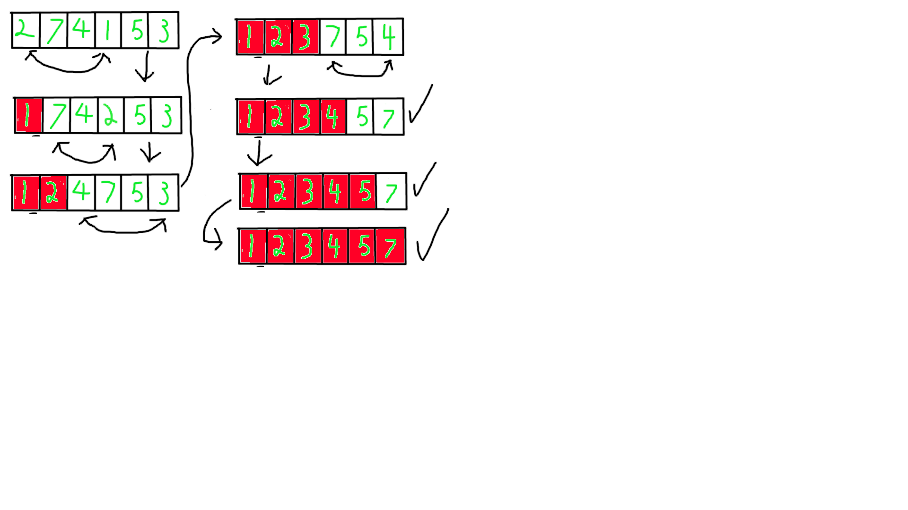
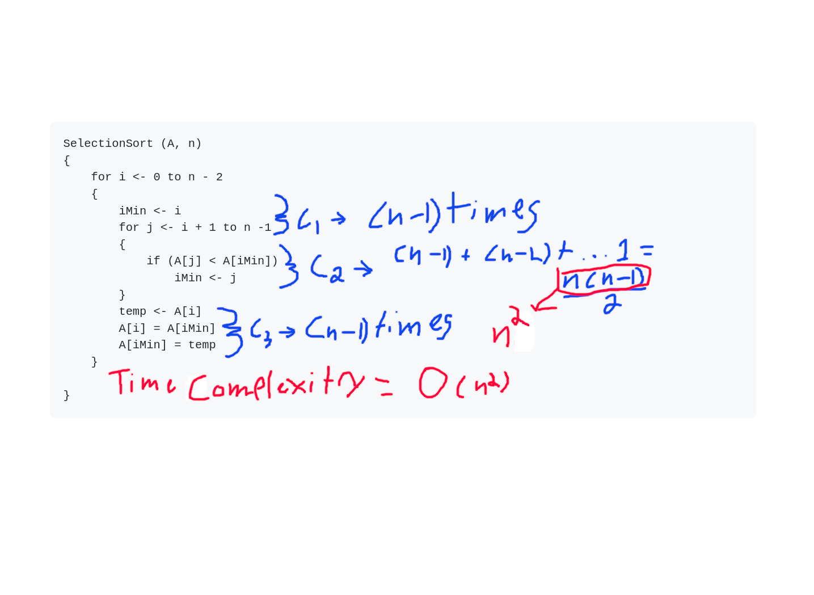

# My Code School Sorting Algorithms Playlist Notes

## Introduction to Sorting Algorithms
 
*Sorting is arranging the elements in a list or collection  
in increasing or decreasing order of some property*  

**e.g.**

*[2, 3, 9, 4, 6]*

- [2, 3, 4, 6, 9] *(Increasing order of value)*
- [9, 6, 4, 3, 2] *(Decreasing order of value)*
- [2, 3, 9, 4, 6] *(Increasing order of number of factors)*

***Sorting Algorithms***

- Bubble sort
- Selection sort
- Insertion sort
- Merge sort
- Quick sort
- Heap sort
- Counting sort
- Radix sort

***Classification***

1. Time complexity
1. Space complexity or memory usag
	- In-place, constant memory
	- Memory usage grows with input size
1. Stability
	- Preserves related order of elements
1. Internal sort vs external sort
	- Internal: All records are in main memory  
	or RAM
	- External: Records are in persistent memory  
	like ssd, hdd, etc.
1. Recursive or non-recursive
	- Recursive: Quick sort, merge sort
	- Non-recursive: Insertion sort, selection sort,  
	and bubble sort

## Selection Sort Algorithm

***Example***
  

***Pseudo Code***
```
SelectionSort (A, n)
{
	for i <- 0 to n - 2
	{
		iMin <- i
		for j <- i + 1 to n -1
		{
			if (A[j] < A[iMin])
				iMin <- j
		}
		temp <- A[i]
		A[i] = A[iMin]
		A[iMin] = temp
	}

}
```
***In C++***  
  
```cpp
#include <stdio.h>
#include <iostream>
#include <string>

std::string arrToString(int array[], int n){
	std::string stringArr = "[";

	for(int i = 0; i < n; i++){
		if(i + 1 == n){
			stringArr += std::to_string(array[i]);
			stringArr += "]";
			break;
		}
		stringArr += std::to_string(array[i]);
		stringArr += ", ";
	}
	return stringArr;

}

int main(){
	int list[] = {2, 7, 4, 1, 5, 3};
	int n = sizeof(list)/sizeof(int);
	int iMin = 0;
	int temp = 0;
	std::cout << "Unsorted array: " + arrToString(list, n)<< std::endl;
	for(int i = 0; i < n; i++){
		iMin = i;

			for(int j = i + 1; j < n; j++){
				if(list[j] < list[iMin]){
					iMin = j;
				}
			}
			temp = list[i];
			list[i] = list[iMin];
			list[iMin] = temp;

	}
	std::cout << "Sorted array: " + arrToString(list, n) << std::endl;


	return 0;
}
```
  
***Evaluating Time Complexity of Selection Sort***  
  

## Bubble Sort Algorithm

 ***How does it work?***
 - First loop through array n - 1 times
 - Then on each loop, loop through array i + 1 to n - 1  
 times
 - On each of the inner loops cycles, swap array[i] with  
 array[i + 1] if array[i] > array[i + 1]

***In C++***

```cpp
#include <stdio.h>
#include <iostream>
#include <string>

std::string arrToString(int array[], int n){
	std::string stringArr = "[";

	for(int i = 0; i < n; i++){
		if(i + 1 == n){
			stringArr += std::to_string(array[i]);
			stringArr += "]";
			break;
		}
		stringArr += std::to_string(array[i]);
		stringArr += ", ";
	}
	return stringArr;

}

int main(){
	int list[] = {2, 7, 4, 1, 5, 3};
	int n = sizeof(list)/sizeof(int);
	int iMin = 0;
	int temp = 0;
	std::cout << "Unsorted array: " + arrToString(list, n)<< std::endl;
	/*
		T(n) = (n - 1) * (n - 1) * c
		= cn^2 - 2cn + 1
		= O(n^2)
	*/

	for(int i = 0; i < n; i++){
			for(int j = 0; j < n; j++){
				if(list[j] > list[j + 1] && j + 1 != n){ // C
					temp = list[j];
					list[j] = list[j + 1];
					list[j + 1] = temp;
				}
			}
			
	}
	std::cout << "Sorted array: " + arrToString(list, n) << std::endl;


	return 0;
}
```

***Can We Make it Faster?***  

You can make bubble sort run a bit faster if you, for instance,  
have the inner loop only traverse the unsorted part of the array.  
However, you will still have a time complexity of O(n^2) in the best  
case, as well in both the average and worst case. We also see in  
figure 1, that we make multiple passes through the array without swapping,  
so we could break out of the outer loop if the inner loop hasn't swapped  
any elements, because then the array will already be sorted. This will  
bring our time complexity down to O(n), which is pretty good. But this  
is only in the best case. In the average case we will have to traverse  
the inner loop some fraction of n times, and in the worst case it will be  
n - 1 times, and both of those cases have a time complexity of O(n^2).  
So, we can make it slightly faster, but the algorithm itself is not efficient  
enough.

## Insertion Sort Algorithm

***How Does it Work?***
- Loop through list n - 1 times
- Store each value in list in a temp variable  
- Assign "hole" to current index
- while hole is > 0 and list at index hole - 1  
is greater than current temp value, run loop  
- On each iteration, assign element at index, hole,  
to index hole - 1 and decrement hole variable  
- After while loop, assign temp variable to element  
at index hole

***In C++***

```cpp
#include <stdio.h>
#include <iostream>
#include <string>

std::string arrToString(int array[], int n){
	std::string stringArr = "[";

	for(int i = 0; i < n; i++){
		if(i + 1 == n){
			stringArr += std::to_string(array[i]);
			stringArr += "]";
			break;
		}
		stringArr += std::to_string(array[i]);
		stringArr += ", ";
	}
	return stringArr;

}

int main(){
	int list[] = {2, 7, 4, 1, 5, 3};
	int n = sizeof(list)/sizeof(int);
	int hole = 0; // 0_0
	int temp = 0;
	std::cout << "Unsorted array: " + arrToString(list, n)<< std::endl;
	for(int i = 0; i < n; i++){

		temp = list[i];

		hole = i;
		while(hole > 0 && list[hole - 1] > temp){
			list[hole] = list[hole - 1];
			hole--;
		}
		list[hole] = temp;
	}
	std::cout << "Sorted array: " + arrToString(list, n) << std::endl;


	return 0;
}
```
